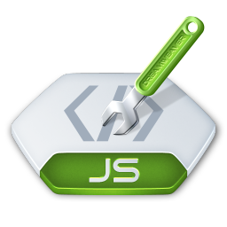

# Проект: Сайт "JS-Старт"

Разработан в качестве практического задания на курсе *SkillFactory* **'Профессия Веб-разработчик'**.

Сайт состоит из стартовой страницы с навигацией и отдельными страницами с выполненными практическими работами. 

## Используемые технологии

* HTML

* CSS

* JavaScript

### На сайте используются собственные разработанные стили, а именно:

* Сайт хорошо смотрится также на мобильных устройствах с шириной экрана до *360px* (добавил **адаптив**, убрал лишние элементы, уменьшил отступы).

* На сайте **плавная анимация** при наведении на некоторые элементы страницы (ссылки, кнопки и т.д.).

* В этом проекте использовал **псевдоэлементы** и **псевдоклассы** для улучшения внешнего вида сайта.

* Добавил **иконку сайта** во вкладку браузера (favicon).

* Добавил **шрифты Google-fonts**: (*'Montserrat', 'Lobster', cursive; 'Reggae One', cursive;*).

* **Цвет фона и шрифта контрастны** (темный фон, светлый текст).

* Для навигации по сайту, а также для запуска функций создал **анимированные кнопки** для улучшения внешнего вида.

## Как открыть/запустить

Зайти в папку сайта в файловом менеджере, кликнуть 2 раза по файлу ***index.html***.

## Заключение

### Что удалось?

* **Создал сайт** с практическими работами; 

* **Применил собственные стили** к этой странице;

* **Выполнил поставленные задачи** в рамках данного урока;

* **Закрепил знания** по HTML и CSS; 

* **Ознакомился** с базовыми возможностями **JavaScript**;

* **Сайт проверен** в валидаторе W3C;

### Дальнейшие планы (что можно улучшить)

* Добавить страницы на сайт с новыми практическими работами;

* Ознакомиться с основными и продвинутыми возможностями JavaScript, и применить эти знания на сайте;

* Добавить больше интерактива, динамики, анимации на сайте, виджеты, слайдеры и т.д.;

* Добавить небольшую задержку при переходе с одной страницы сайта на другую, чтобы успевала проигрываться анимация кнопок до конца 0.5сек для большей плавности

* Плавный якорь на JS для плавного скролла при переходе по ссылкам внутри страницы.

* Улучшить меню навигации в header при адаптиве;

* Улучшать дизайн сайта;

* ... и т.д. 